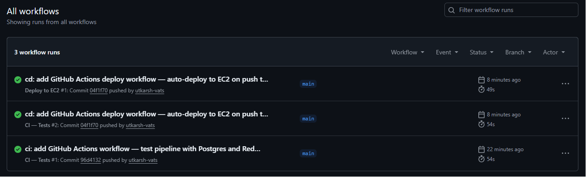
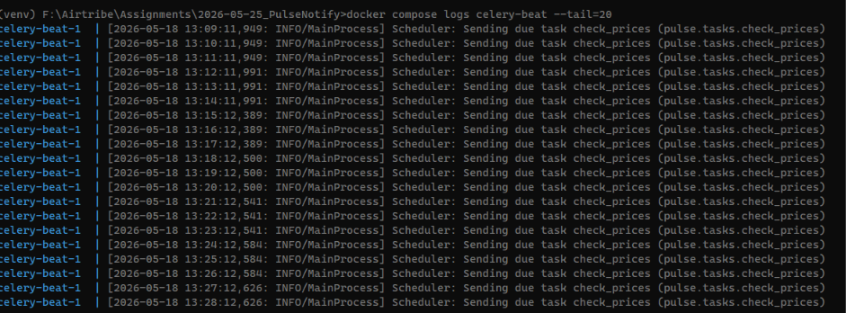
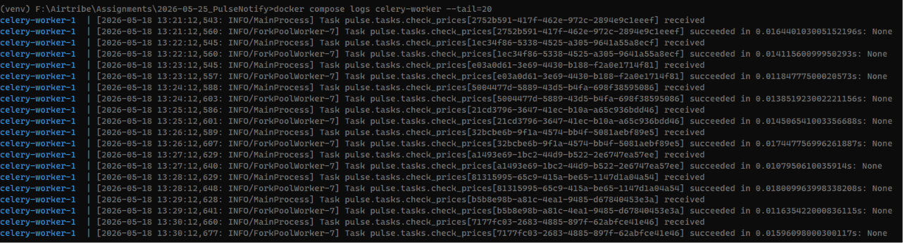
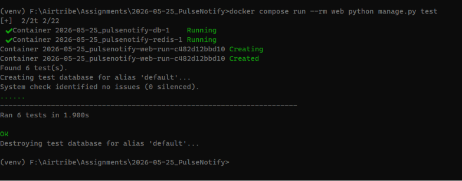
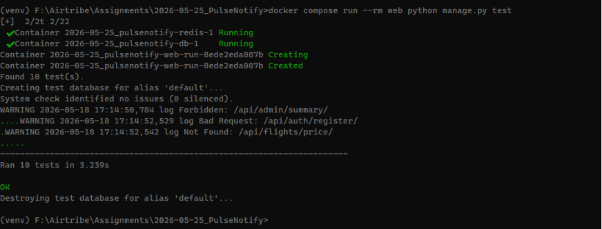

# PulseNotify — Flight Price Alert System

A production-grade flight price monitoring backend. Users set price alerts for Indian domestic flight routes; the system checks prices every 60 seconds and fires notifications when thresholds are hit. Built with Django REST Framework, Celery, Redis, and PostgreSQL — fully containerized and deployed on AWS EC2 with CI/CD.

**Live API:** [https://api.pulsenotify.obtuse.in/api/docs/](https://api.pulsenotify.obtuse.in/api/docs/)

---

## Assignment vs What Was Built

This project started as a cohort assignment with specific requirements. The table below shows what was asked for and what was actually delivered.

### Required by Assignment

| Requirement                                                           | Status                  |
| --------------------------------------------------------------------- | ----------------------- |
| Django + DRF backend with 7 endpoints                                 | ✅ Done                  |
| PostgreSQL + Redis via Docker Compose                                 | ✅ Done                  |
| `settings/` folder with base.py, local.py, production.py              | ✅ Done                  |
| `tasks.py` with check_prices and send_notification using @shared_task | ✅ Done                  |
| `signals.py` with UserProfile auto-creation via post_save             | ✅ Done                  |
| `permissions.py` with custom IsAdminUser class                        | ✅ Done                  |
| `tests.py` with 3 required unit tests passing                         | ✅ Done (expanded to 10) |
| `requirements.txt` with all dependencies pinned                       | ✅ Done                  |
| Postman collection covering all 13 scenarios                          | ✅ Done (15 scenarios)   |
| README.md with setup instructions                                     | ✅ Done                  |
| JWT auth (register + login)                                           | ✅ Done                  |
| Alert CRUD scoped to request.user                                     | ✅ Done                  |
| Mock price feed with random prices                                    | ✅ Done                  |
| Admin summary with ORM aggregation (no Python loops)                  | ✅ Done                  |
| Celery Beat schedule (60-second interval)                             | ✅ Done                  |
| Async notification via .delay()                                       | ✅ Done                  |

### Beyond the Assignment

| Area           | Assignment Spec                   | What We Built                                                                |
| -------------- | --------------------------------- | ---------------------------------------------------------------------------- |
| Primary keys   | Default integer IDs               | UUID4 via abstract BaseModel on all pulse models                             |
| Mock routes    | 4 hardcoded routes in views.py    | 60+ Indian domestic routes in separate `mock_data.py` with IATA codes        |
| Price response | Route + price only                | Added origin/destination airport names from AIRPORT_CODES dict               |
| Tests          | 3 model-level tests               | 10 tests — 6 model-level + 4 endpoint-level                                  |
| API docs       | Not required                      | Auto-generated Swagger UI via drf-spectacular at `/api/docs/`                |
| Logging        | Not required                      | Python logging in Celery tasks + LOGGING config with verbose formatter       |
| Admin panel    | Not required                      | All models registered with list_display, list_filter, and search_fields      |
| Docker         | DB + Redis only, manual runserver | 6-service Docker Compose (web, db, redis, nginx, celery-worker, celery-beat) |
| Error handling | Not specified                     | try/except in tasks, request timeouts, graceful handling of deleted alerts   |
| Timestamps     | created_at only                   | BaseModel adds updated_at (auto_now) to all models                           |
| Deployment     | Not required                      | AWS EC2 (t2.micro, ap-south-1) with Gunicorn + Nginx reverse proxy           |
| HTTPS          | Not required                      | Let's Encrypt SSL with auto-renewal via cron                                 |
| CI/CD          | Not required                      | GitHub Actions — test pipeline + auto-deploy to EC2 on push to main          |
| Static files   | Not required                      | collectstatic + shared Docker volume served via Nginx                        |

---

## How It Works

```
User sets alert: route=DEL-BOM, threshold=₹4500
        ↓
POST /api/alerts/  →  PriceAlert saved to DB
        ↓
Celery Beat fires every 60 seconds
        ↓
check_prices task wakes up
        ↓
GET /api/flights/price/?route=DEL-BOM  (internal mock endpoint)
        ↓
Mock endpoint returns { "route": "DEL-BOM", "price": 4200 }
        ↓
4200 <= 4500 threshold? YES
        ↓
send_notification.delay()  (async Celery task)
        ↓
NotificationLog written to DB, alert marked as TRIGGERED
        ↓
GET /api/admin/summary/  →  Admin sees platform-wide stats
```

---

## Tech Stack

- **Backend:** Django 6.0, Django REST Framework
- **Auth:** SimpleJWT (Bearer token)
- **Task Queue:** Celery 5.6 with Redis broker
- **Scheduler:** Celery Beat (60-second interval)
- **Database:** PostgreSQL 18
- **Cache/Broker:** Redis 7
- **Containerization:** Docker & Docker Compose
- **Web Server:** Gunicorn (production) + Nginx reverse proxy
- **API Docs:** drf-spectacular (Swagger UI)
- **CI/CD:** GitHub Actions (test + deploy)
- **Hosting:** AWS EC2 (t2.micro, ap-south-1)
- **SSL:** Let's Encrypt with auto-renewal

---

## Project Structure

```
pulsenotify/
├── .github/
│   └── workflows/
│       ├── ci.yml                # Test pipeline (Postgres + Redis services)
│       └── deploy.yml            # Auto-deploy to EC2 via SSH
├── pulse/                        # Django app
│   ├── models.py                 # UserProfile, PriceAlert, NotificationLog
│   ├── views.py                  # All 7 API endpoints
│   ├── serializers.py            # DRF serializers
│   ├── signals.py                # post_save → auto-create UserProfile
│   ├── permissions.py            # IsAdminUser custom permission
│   ├── tasks.py                  # check_prices (Beat) + send_notification (async)
│   ├── mock_data.py              # 60+ Indian domestic routes with price ranges
│   ├── admin.py                  # Model registration with filters and search
│   ├── urls.py                   # App URL routing
│   └── tests.py                  # 10 unit tests
├── pulsenotify/                  # Django project config
│   ├── celery.py                 # Celery app configuration
│   ├── __init__.py               # Celery app import
│   ├── urls.py                   # Root URL conf
│   └── settings/
│       ├── base.py               # Shared config (apps, JWT, Celery, DB, logging)
│       ├── local.py              # Dev: DEBUG=True, loads .env.local
│       └── production.py         # Prod: DEBUG=False, loads .env.prod
├── nginx/
│   └── prod.nginx.conf           # Nginx config with SSL termination
├── docker-compose.yml            # Dev: 5 services (web, db, redis, worker, beat)
├── docker-compose.prod.yml       # Prod: 6 services (+ nginx, no volume mounts)
├── Dockerfile
├── requirements.txt
├── .env.example                  # Template for env vars (committed)
├── .env.local                    # Dev env vars (gitignored)
├── .env.prod                     # Prod env vars (gitignored)
├── Airtribe_PulseNotify.postman_collection.json
├── LICENSE
└── README.md
```

---

## Running Locally

### Prerequisites

- Docker & Docker Compose
- Git
- Postman (for API testing)

### 1. Clone and configure

```bash
git clone https://github.com/utkarsh-vats/Airtribe_PulseNotify.git
cd Airtribe_PulseNotify
cp .env.example .env.local
```

Edit `.env.local` with your values:

```env
SECRET_KEY=your-django-secret-key
DEBUG=True
DB_NAME=pulsenotify
DB_USER=postgres
DB_PASSWORD=your-password
DB_HOST=db
DB_PORT=5432
POSTGRES_DB=pulsenotify
POSTGRES_USER=postgres
POSTGRES_PASSWORD=your-password
DJANGO_SETTINGS_MODULE=pulsenotify.settings.local
```

### 2. Build and start

```bash
docker compose up --build
```

This starts 5 containers:

| Service       | Description                  | Port        |
| ------------- | ---------------------------- | ----------- |
| web           | Django dev server            | 8000        |
| db            | PostgreSQL 18                | 8080 → 5432 |
| redis         | Redis 7 (Celery broker)      | 6379        |
| celery-worker | Processes async tasks        | —           |
| celery-beat   | Fires check_prices every 60s | —           |

### 3. Run migrations and create superuser

```bash
docker compose run --rm web python manage.py migrate
docker compose run --rm web python manage.py createsuperuser
```

### 4. Verify everything works

- `http://localhost:8000/api/docs/` — Swagger API docs
- `http://localhost:8000/admin/` — Django admin panel
- Watch terminal logs — Beat fires every 60 seconds, worker processes tasks

---

## Running in Production

### Prerequisites

- AWS EC2 instance (Ubuntu, t2.micro works)
- Docker & Docker Compose installed on the instance
- Domain with DNS A record pointing to the EC2 public IP

### 1. Clone and configure on EC2

```bash
git clone https://github.com/utkarsh-vats/Airtribe_PulseNotify.git
cd Airtribe_PulseNotify
nano .env.prod
```

Production env vars:

```env
SECRET_KEY=a-strong-random-secret-key
DB_NAME=pulsenotify
DB_USER=postgres
DB_PASSWORD=a-strong-password
DB_HOST=db
DB_PORT=5432
POSTGRES_DB=pulsenotify
POSTGRES_USER=postgres
POSTGRES_PASSWORD=a-strong-password
DJANGO_SETTINGS_MODULE=pulsenotify.settings.production
ALLOWED_HOSTS=your-ec2-ip,localhost,web,your-domain.com
```

### 2. Build and start (production)

```bash
docker compose -f docker-compose.prod.yml up --build -d
docker compose -f docker-compose.prod.yml run --rm web python manage.py migrate
docker compose -f docker-compose.prod.yml run --rm web python manage.py collectstatic --noinput
docker compose -f docker-compose.prod.yml run --rm web python manage.py createsuperuser
```

This starts 6 containers (adds Nginx on port 80/443 to the dev stack).

### 3. HTTPS with Let's Encrypt (optional)

```bash
sudo apt install -y certbot
docker compose -f docker-compose.prod.yml stop nginx
sudo certbot certonly --standalone -d your-domain.com
docker compose -f docker-compose.prod.yml up -d
```

Auto-renewal via cron:

```bash
sudo crontab -e
# Add: 0 3 * * * certbot renew --quiet && docker compose -f /home/ubuntu/Airtribe_PulseNotify/docker-compose.prod.yml restart nginx
```

---

## API Endpoints

| #   | Method | Endpoint                            | Auth        | Description                              |
| --- | ------ | ----------------------------------- | ----------- | ---------------------------------------- |
| 1   | POST   | `/api/auth/register/`               | Public      | Register new user, returns JWT           |
| 2   | POST   | `/api/auth/login/`                  | Public      | Login, returns JWT                       |
| 3   | POST   | `/api/alerts/`                      | JWT         | Create a price alert                     |
| 4   | GET    | `/api/alerts/`                      | JWT         | List logged-in user's alerts             |
| 5   | DELETE | `/api/alerts/<id>/`                 | JWT         | Deactivate an alert (soft delete)        |
| 6   | GET    | `/api/flights/price/?route=DEL-BOM` | Public      | Mock price feed (random price)           |
| 7   | GET    | `/api/admin/summary/`               | JWT + Admin | Platform-wide alert & notification stats |
| —   | GET    | `/api/docs/`                        | Public      | Swagger API documentation                |
| —   | GET    | `/api/schema/`                      | Public      | OpenAPI schema (JSON)                    |

### Available Mock Routes (60+)

| Route   | Price Range     | Origin                               | Destination                            |
| ------- | --------------- | ------------------------------------ | -------------------------------------- |
| DEL-BOM | ₹3,000 – ₹7,000 | Delhi (Indira Gandhi International)  | Mumbai (Chhatrapati Shivaji Maharaj)   |
| BLR-HYD | ₹1,500 – ₹4,000 | Bangalore (Kempegowda International) | Hyderabad (Rajiv Gandhi International) |
| DEL-BLR | ₹4,000 – ₹9,000 | Delhi                                | Bangalore                              |
| BOM-GOA | ₹2,000 – ₹5,000 | Mumbai                               | Goa (Manohar International)            |
| MAA-CCU | ₹3,500 – ₹7,000 | Chennai                              | Kolkata                                |
| DEL-SXR | ₹3,000 – ₹8,000 | Delhi                                | Srinagar                               |

<!-- Full list in `pulse/mock_data.py` with IATA code reference. -->
Full list in *[pulse/mock_data.py](pulse/mock_data.py)* with IATA code reference.


---

## Celery Tasks

**check_prices** — scheduled every 60 seconds via Celery Beat
- Fetches all distinct routes with active alerts
- Calls the mock price endpoint via `requests.get()` (backend-to-backend pattern)
- Compares current price against each alert's threshold
- Fires `send_notification.delay()` if price ≤ threshold
- Logs every price check and error

**send_notification** — async, triggered by check_prices via `.delay()`
- Creates a NotificationLog entry with triggered price and message
- Marks the alert as TRIGGERED (won't fire again)
- Catches DoesNotExist gracefully if alert was deleted between check and notification

---

## Running Tests

```bash
docker compose run --rm web python manage.py test
```

10 tests across 5 test classes:

**Model-level:**
- Price below threshold triggers alert
- Price above threshold does not trigger
- Price equal to threshold triggers (edge case)
- NotificationLog created with correct message and relationships
- User only sees their own alerts (scoping)
- User cannot see other users' alerts

**Endpoint-level:**
- Register returns 400 on duplicate username
- Admin summary returns 403 for regular user
- Alert deactivation changes status to INACTIVE
- Mock price feed returns 404 for unknown route

---

## CI/CD Pipeline

GitHub Actions runs two workflows on every push to `main`:

**CI — Tests** (`ci.yml`)
- Spins up Postgres + Redis as service containers
- Installs dependencies, runs migrations, runs all 10 tests
- Fails the pipeline if any test breaks

**Deploy to EC2** (`deploy.yml`)
- SSHs into the EC2 instance via `appleboy/ssh-action`
- Pulls latest code, rebuilds Docker containers, runs migrations, collects static files
- Zero-downtime deployment


*All workflows passing — CI tests + auto-deploy to EC2.*

---

## Postman Collection

Import `Airtribe_PulseNotify.postman_collection.json` into Postman.

15 requests across 4 folders with auto-saved tokens:

| Folder  | Scenarios                                                                                 |
| ------- | ----------------------------------------------------------------------------------------- |
| Auth    | Register, duplicate register (400), login, login user2, login admin, wrong password (401) |
| Alerts  | Create alert, list alerts, deactivate alert, unauthorized delete (404), no JWT (401)      |
| Flights | Valid route (200), invalid route (404)                                                    |
| Admin   | Summary as admin (200), summary as non-admin (403)                                        |

Collection variables: `base_url`, `access_token`, `access_token_user2`, `access_token_admin`, `alert1_id` — all auto-populated from response scripts.

---

## Screenshots

### Auth Endpoints
---
*New user registered successfully — returns JWT access token and role.*


---
*Attempting to register an existing username — returns 400 with error message.*


---
*Valid credentials — returns 200 with fresh JWT access and refresh tokens.*


---
*Wrong password — returns 401 Unauthorized.*


### Alert Endpoints
---
*Listing all alerts for the authenticated user — scoped to request.user only.*


---
*Creating a new price alert for DEL-BOM with ₹4500 threshold — returns 201.*


---
*Soft-deleting an alert — status set to inactive, row preserved in DB.*


---
*Attempting to create an alert without a JWT token — returns 401.*


---
*User2 attempting to delete User1's alert — returns 404, never exposing another user's data.*


### Flights
---
*Mock price feed returning a random price for DEL-BOM within the ₹3000–₹7000 range.*


---
*Requesting an unknown route — returns 404 with error message.*


### Admin
---
*Admin-only endpoint returning platform-wide stats — total alerts, active/triggered counts, top routes.*


---
*Regular user attempting to access admin summary — returns 403 Forbidden.*


### Celery Tasks
---
*Celery Beat firing check_prices every 60 seconds on schedule.*


---
*Worker processing check_prices → price below threshold → send_notification task received and succeeded.*


### Tests
---
*All 6 unit tests passing — threshold logic, notification log creation, and alert scoping.*


---
*10 tests passing — unit tests + duplicate user, admin summary, alert deactivation and mock price feed.*


### CI/CD
---
*GitHub Actions — CI tests + auto-deploy to EC2, all workflows passing.*


---

## Environment Configuration

| File                     | Purpose                                                           |
| ------------------------ | ----------------------------------------------------------------- |
| `settings/base.py`       | Shared config — apps, middleware, JWT, Celery, database, logging  |
| `settings/local.py`      | Loads `.env.local`, sets DEBUG=True, ALLOWED_HOSTS=['*']          |
| `settings/production.py` | Loads `.env.prod`, sets DEBUG=False, reads ALLOWED_HOSTS from env |
| `.env.example`           | Template with all required keys (committed to repo)               |
| `.env.local`             | Local dev values (gitignored)                                     |
| `.env.prod`              | Production values (gitignored, lives on EC2 only)                 |

---

## License

This project is licensed under the MIT License — see the [LICENSE](LICENSE) file for details.